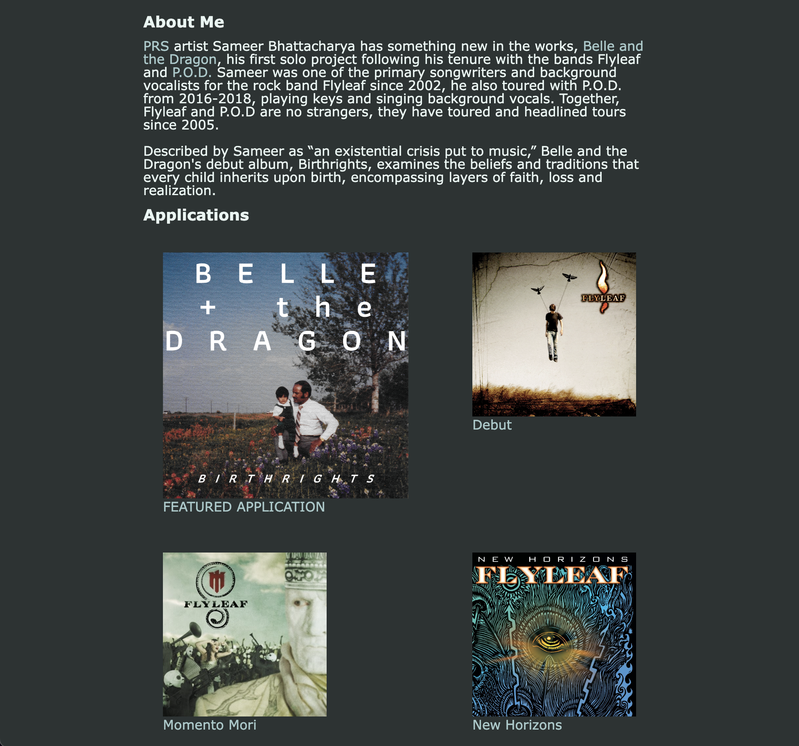
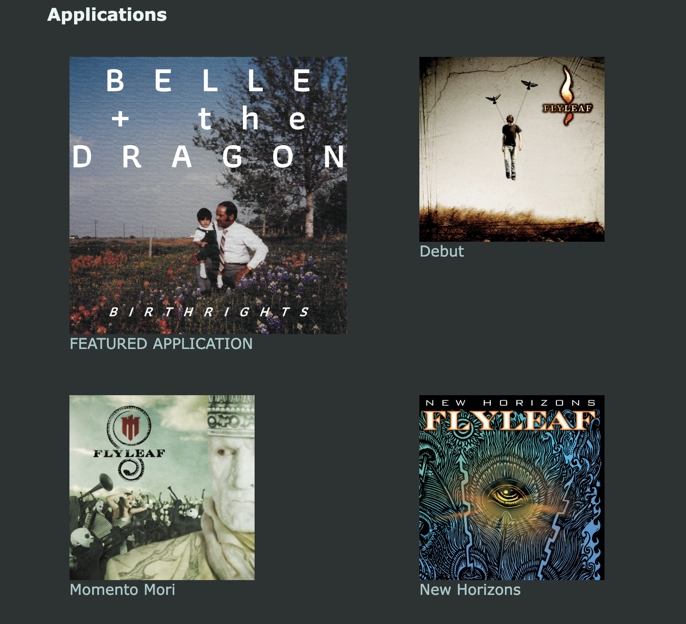
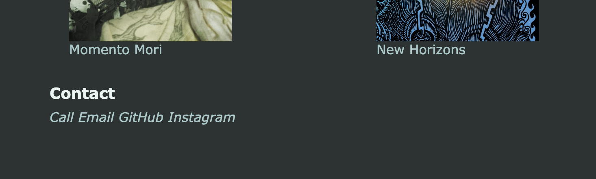

# Welcome to Sameer's Portfolio

The first thing to notice is that I haven't built and Applications yet, but, with it being my first week of learning to code that will change!

So as placeholders I have linked albums I have created with my friends so you can enjoy sweet tunes while reviewing my work.

1. The first thing you will see in the responsive Header is my name "Sameer Bhattacharya" and Navigation links that will take you to the corrosponding sections.

2. Below the Header you will find the About Me section that I copied and pasted from an article, because I'm too self-conscious to write about myself.

Go ahead and hover your mouse over the About Me section to find some words that are hyperlinks. Feel secure clicking the links, because they open up into a new tab so you don't have to leave the page!

3. Next you will find the Work section with has four album covers (my placeholder applictions) which is my day job: music! Each album is connected to a hyperlink that takes you to their corrosponding pages on Spotify. So go ahead and Enjoy!

4. Contact Me! Here here you can contact me and talk shop about music, and now WEB DEVELOPMENT!

GitHub link: https://github.com/sameersamuel/sameer-portfolio-m02.git
Depolyed link: https://sameersamuel.github.io/sameer-portfolio-m02/

